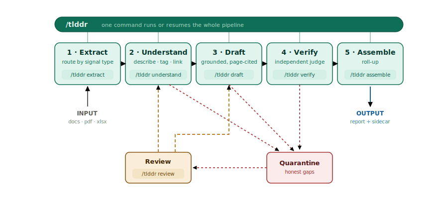

# tl;ddr

[](https://github.com/TimEvans/tlddr/actions/workflows/tests.yml)
[](LICENSE)
[](https://github.com/astral-sh/uv)

**Template-driven report generation, grounded in a source corpus.**

`tlddr` reads a pile of source documents and drafts a structured report against a
template you provide — so the reviewer's job shifts from "read everything and write from
scratch" to "review, correct, sign off." Every claim carries page-level attribution back
to the document it came from, and the tool **flags what it is unsure about instead of
guessing**: an honest gap is worth more than confident, unverifiable coverage.

In industry terms it is a grounded, attributed report-generation system built on agentic
RAG — claim-level attribution, agentic retrieval, faithfulness verification, and
abstention. Due diligence is the origin and one application; nothing in the machinery is
specific to it. The same pipeline grounds any template-driven report in a source corpus
with page-level citations.

> Status: proof-of-concept. Proven end-to-end on a real SEC filing (Chevron FY2025 10-K)
> drafted against a 42-section annual-report template.

## How it works

<p align="center">
  
</p>

A four-stage pipeline over a shared vault, with quarantine as a cross-cutting channel for
anything the tool cannot understand or has no evidence for:

1. **Extract** — route each source document by *signal type* (does the meaning live in the
   text layer or the pixels?), not file extension, into extracted node stubs.
2. **Understand** — per node: describe it, tag it against the report's sections, set
   confidence, and propose cross-document edges. Produces a linked, triaged vault.
3. **Draft** — gather the nodes for each section and draft against it, emitting claims
   carrying `(node_id, page)` provenance. Thin or evidence-free sections become findings,
   not fabrications.
4. **Verify + Assemble** — an independent judge pass flags contradictions and unsupported
   claims, then a deterministic roll-up produces the attributed report plus a reviewer
   sidecar of provenance, inferences, and open questions.

A **review / answer loop** closes the cycle: a reviewer signs off the open questions and
`tlddr` re-runs only the affected nodes or sections.

The deterministic steps are `tlddr` CLI commands. The model-driven stages (Understand,
Draft, Verify, Review) are run by an agent following the procedures in `skills/`, so every
stage is separately runnable and inspectable. A `/tlddr` launcher sequences the whole
pipeline for you and records progress in a deterministic run-state manifest, so a run can
be resumed from wherever it stopped.

## Install

Requires Python 3.11+. Managed with [uv](https://docs.astral.sh/uv/):

```bash
uv sync                # create .venv and install tlddr + dependencies
uv sync --extra dev    # include dev extras (pytest)
```

## Usage

### The launcher (recommended)

Inside a Claude Code session, one command runs or resumes the whole pipeline:

```
/tlddr
```

It asks only for the essentials — where your documents are, an output directory, and a
preset — then runs the stages end to end, pausing for your sign-off where the preset says
to. On an existing run it offers to **resume** from wherever you left off. Presets bundle
the model / effort / interaction settings:

- `quick` (recommended) — fast, lower-cost first pass; runs to completion, then surfaces
  the review queue.
- `careful` — higher-rigour pass that pauses between stages for review.

The launcher is one command with a small family of verbs — a single, consistent surface,
whether a stage runs deterministic code or an agent underneath:

```
/tlddr                 # interactive: configure if needed, then run or resume
/tlddr draft           # run (or re-run) just one stage: extract | understand |
                       #   draft | verify | assemble | review
/tlddr status          # show progress and the resume point
/tlddr resume          # continue from the resume point to the end
```

### The CLI (deterministic stages)

Every deterministic step is a `tlddr` subcommand you can run directly. Paths derive from a
single output base — the current directory by default, or set `--output <dir>` (or the
`TLDDR_OUTPUT` env var) — so a run stays bundled and a second run never clobbers the first:

```bash
uv run tlddr extract --source <docs-dir> --output myrun
uv run tlddr --help                        # full command list
```

The model-driven stages (`understand`, `generate-sections`, `draft`, `draft-verify`,
`review`) are run by the host agent following the matching procedure in `skills/`; the
launcher simply sequences these for you. Configuration is saved to `tlddr.toml` at the top
of the output base — edit its `[overrides]` table to pin a setting (model, effort, …)
across runs, or pass flags to `tlddr config`.

## Output

A completed run produces, under your output base (the current directory by default):

- `report/report.md` — the attributed draft, claims cited to source page.
- `report/report_comments.md` — reviewer sidecar: provenance, inferences, no-evidence
  gaps, and the open questions to resolve.
- `vault/` — the linked, triaged understand vault (`_index.md`, `_triage.md`).
- `tlddr.toml` — the run's configuration (editable).
- `.tlddr/` — hidden working state: extracted content, the claim / verdict / question
  stores, and the run-state manifest (`state_lock.json`). Read it via `tlddr status`
  rather than by hand.

## License

MIT — see [LICENSE](LICENSE).
